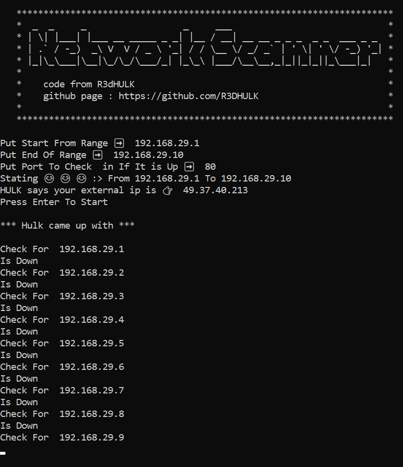
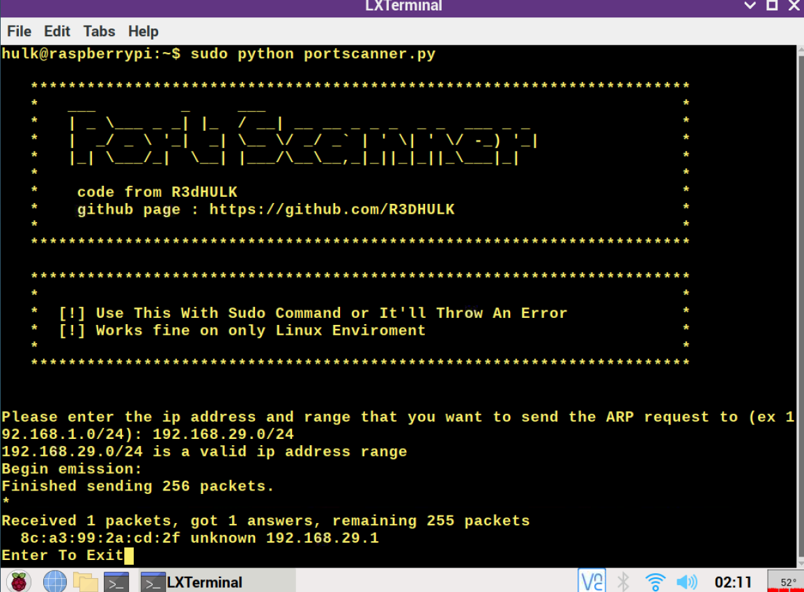
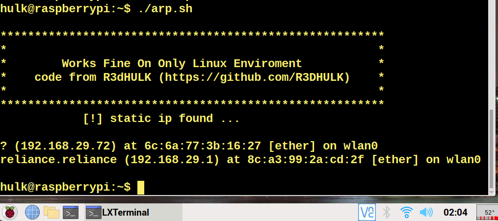

# Local Area Network Finder Tool 
##
__Author__ : R3DHULK
##
## What is Local Area Network ?
``` 
A local area network (LAN) is a collection of devices connected together in one physical location, such as a building, office, or home. A LAN can be small or large, ranging from a home network with one user to an enterprise network with thousands of users and devices in an office or school.
```
##
## What is this tool used for?
```
This Tool Can Be Used For Capturing The IP Address, which are already registered and live on your local area network (such as wifi)
```
##
## Network-Scanner.py tool can be used on all oses
## 
## Git Installation :
```
# direct download from the url
git clone https://github.com/R3DHULK/ip-scanner.git

# change directory to ip-scanner
cd ip-scanner

# install requirements
pip install -r requirements.txt

# give executable permission on bash file 
chmod +x arp.sh 

# run script for linux
./arp.sh

# run script for windows and all os
python network-scanner.py 

# python portscanner.py (for only linux users)
```
##
## network-scanner.py Output :

##

## portscanner.py output :

##

## arp.sh output :

